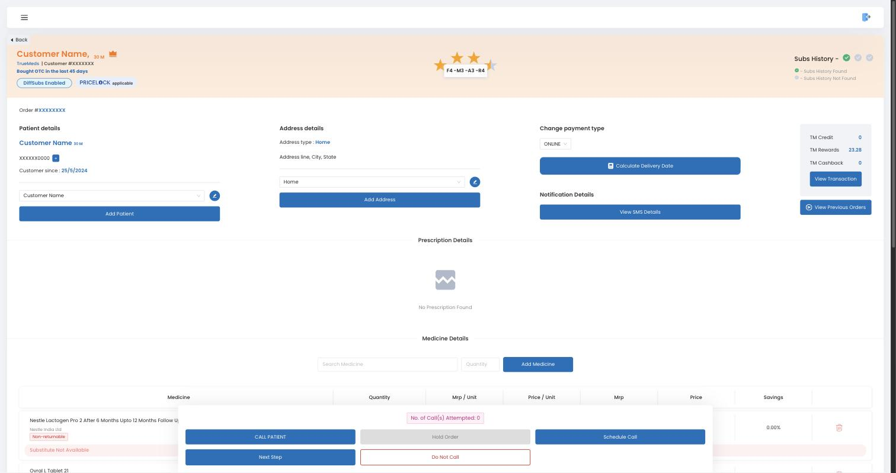
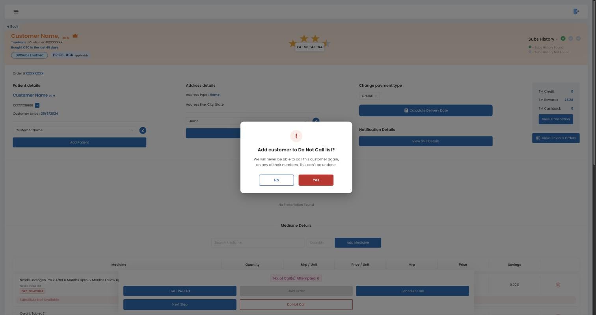

# Do-Not-Call (DNC) One-Pager

*ACOM × Ring AI · Draft for review · 7 Oct 2026 · Owner: Apurva*

## The problem

A customer who says "stop calling me" can't make us stop. The next call still comes, from the same team or another portal, and sometimes on their alternate number. They don't know we run several calling portals. To them it is one company ignoring them.

Each call makes them repeat the request, and nothing changes. Their only options are to ignore us, block our number or complain. Blocking also cuts off the calls about an order they placed. The AI calling at scale makes this worse.

For Truemeds this means complaints, TRAI/DND exposure, and agent and AI effort spent on customers who have already said no.

## Goal

When a customer asks us to stop calling, we stop, on every portal that makes sales calls, permanently.

## This release

- **Customer-level DNC.** Keyed on customer ID, so it blocks every number linked to the customer, including alternate numbers and the patient's number.
- **Ring returns DNC as its own label**, alongside Hot, Warm and Cold. We act only on that label. A DNC lead is not given Hot, Warm or Cold.
- **Enforced in ACOM for the AI and human agents.** No call is attempted to a DNC customer. It takes effect at once: pending retries, scheduled callbacks and Hot/Warm queue entries for that customer are cancelled.
- **Permanent.** Engineering handles any reversal offline, on request.
- **Logging.** Suggested: source (AI or agent), time, and the call it came from. Engineering decides.
- **Audit.** Operations audits the call recordings behind Ring's DNC outcomes to catch wrong labels.

## Fast-follow

- Agent one-click DNC CTA on the ACOM portal, with a confirmation box so a mis-tap doesn't block a customer.
- CSR / pharmacist portal: when a customer calls in asking us to stop, the CSR adds their customer ID to DNC.

Ring, the agent CTA and the CSR all write to the same customer-level DNC.

**Agent CTA journey.** A "Do Not Call" button sits under Hold Order on the lead screen. It opens a confirmation popup. Yes adds the customer to DNC; No closes the popup.

*Mockup on the current ACOM portal screen. Personal data masked.*

## Accepted, not blocking

- A call already dialled before the DNC verdict arrives still goes out.
- If an agent doesn't record a DNC, the customer will reach customer care, and the CSR adds them.

## What DNC stops

- **Stops:** portals that make sales calls: ACOM, Pill Reminder, HA.
- **Does not stop:** calls an order needs to progress, such as the Doctor call and the Type 1 order call.

## Expanding to other portals

Later, one central DNC list that every sales-calling portal checks before calling and adds to. This release is ACOM only.

## End state

The customer sets their own calling preference (DND) in the Truemeds app.

## Out of scope

- The in-app DND option for customers.
- Migrating HA's existing skip logic. It is handled separately.
- Any change to the AI-led Lead Qualification GTM. DNC is a separate feature.
